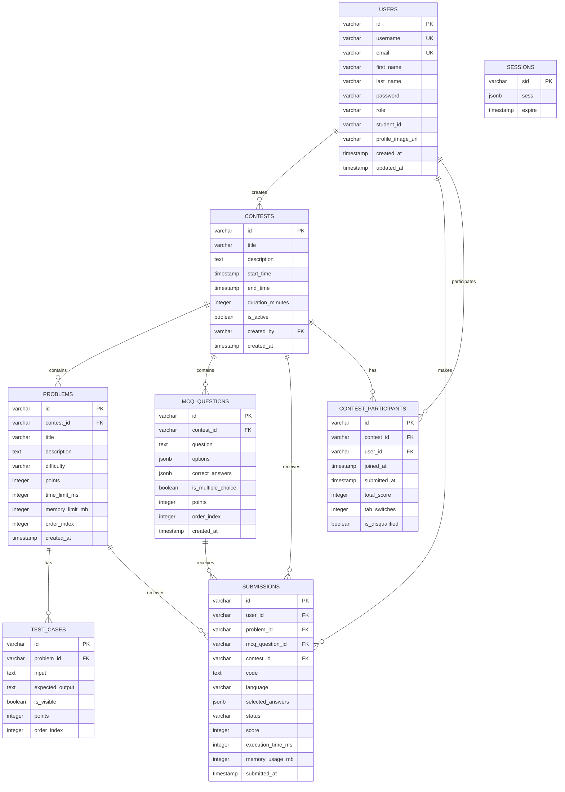

# System Design Document - Skillnox Contest Platform

## 1. Executive Summary

Skillnox is a web-based online coding contest platform designed to facilitate programming competitions for educational institutions. The system provides real-time contest management, automated code evaluation, anti-cheating mechanisms, and comprehensive analytics.

## 2. System Architecture

### 2.1 High-Level Architecture

```
┌─────────────────┐    ┌─────────────────┐    ┌─────────────────┐
│   Web Browser   │    │   Mobile App    │    │   Admin Panel   │
│   (Students)    │    │   (Students)    │    │  (Instructors)  │
└─────────┬───────┘    └─────────┬───────┘    └─────────┬───────┘
          │                      │                      │
          └──────────────────────┼──────────────────────┘
                                 │
                    ┌─────────────▼─────────────┐
                    │      Load Balancer        │
                    │      (Nginx/HAProxy)      │
                    └─────────────┬─────────────┘
                                 │
                    ┌─────────────▼─────────────┐
                    │     Web Application       │
                    │   (React + Express.js)    │
                    └─────────────┬─────────────┘
                                 │
                    ┌─────────────▼─────────────┐
                    │      Application Layer    │
                    │   (Business Logic + API)  │
                    └─────────────┬─────────────┘
                                 │
                    ┌─────────────▼─────────────┐
                    │       Data Layer          │
                    │   (PostgreSQL + Redis)    │
                    └───────────────────────────┘
```

### 2.2 Component Architecture

```
┌─────────────────────────────────────────────────────────────┐
│                    Frontend (React)                        │
├─────────────────────────────────────────────────────────────┤
│  Presentation Layer  │  State Management  │  API Layer     │
│  - UI Components     │  - React Query     │  - HTTP Client │
│  - Pages/Routes      │  - Local State     │  - WebSocket   │
│  - Forms/Validation  │  - Context API     │  - Error Handle│
└─────────────────────────────────────────────────────────────┘
                                │
                                ▼
┌─────────────────────────────────────────────────────────────┐
│                   Backend (Node.js)                        │
├─────────────────────────────────────────────────────────────┤
│  API Gateway  │  Business Logic  │  Data Access  │  Auth    │
│  - Express.js │  - Contest Mgmt  │  - Drizzle ORM│  - JWT   │
│  - Middleware │  - Code Eval     │  - PostgreSQL │  - Session│
│  - Validation │  - Anti-cheat    │  - Redis Cache│  - Passport│
└─────────────────────────────────────────────────────────────┘
                                │
                                ▼
┌─────────────────────────────────────────────────────────────┐
│                    Data Layer                               │
├─────────────────────────────────────────────────────────────┤
│  Primary DB  │  Cache Layer  │  File Storage  │  External  │
│  - PostgreSQL│  - Redis      │  - Local/Cloud │  - APIs    │
│  - ACID      │  - Sessions   │  - Static Files│  - Webhooks│
│  - Relations │  - Leaderboard│  - Uploads     │  - Notifications│
└─────────────────────────────────────────────────────────────┘
```

## 3. Database Design

### 3.1 Entity Relationship Diagram



### 3.2 Database Schema Details

#### Users Table
- **Purpose**: Store user account information
- **Key Fields**: id (PK), username, email, role, student_id
- **Indexes**: username (unique), email (unique), student_id

#### Contests Table
- **Purpose**: Store contest information and configuration
- **Key Fields**: id (PK), title, start_time, end_time, duration_minutes
- **Relationships**: One-to-many with problems, submissions, participants

#### Problems Table
- **Purpose**: Store coding problems within contests
- **Key Fields**: id (PK), contest_id (FK), title, difficulty, points
- **Constraints**: Points > 0, time_limit_ms > 0

#### Test Cases Table
- **Purpose**: Store input/output test cases for problems
- **Key Fields**: id (PK), problem_id (FK), input, expected_output, is_visible
- **Security**: Hidden test cases for final evaluation

#### Submissions Table
- **Purpose**: Store user code submissions and results
- **Key Fields**: id (PK), user_id (FK), problem_id (FK), code, status, score
- **Indexes**: user_id, contest_id, submitted_at

#### Contest Participants Table
- **Purpose**: Track participant status and scores
- **Key Fields**: id (PK), contest_id (FK), user_id (FK), total_score, is_disqualified
- **Business Logic**: One participant per contest per user

## 4. API Design

### 4.1 RESTful API Endpoints

#### Authentication APIs
```
POST   /api/auth/login          # User login
POST   /api/auth/logout         # User logout
GET    /api/auth/me            # Get current user
```

#### Contest Management APIs
```
GET    /api/contests           # List all contests
POST   /api/contests           # Create new contest
GET    /api/contests/:id       # Get contest details
PUT    /api/contests/:id       # Update contest
DELETE /api/contests/:id       # Delete contest
POST   /api/contests/:id/join  # Join contest
POST   /api/contests/:id/submit # Submit contest
GET    /api/contests/:id/status # Get contest status
```

#### Problem Management APIs
```
GET    /api/problems           # List problems
POST   /api/problems           # Create problem
GET    /api/problems/:id       # Get problem details
PUT    /api/problems/:id       # Update problem
DELETE /api/problems/:id       # Delete problem
```

#### Submission APIs
```
POST   /api/submissions        # Submit code
GET    /api/submissions/user/:userId # Get user submissions
POST   /api/execute-code       # Execute code (test run)
```

#### Leaderboard APIs
```
GET    /api/contests/:id/leaderboard # Get contest leaderboard
```

### 4.2 WebSocket Events

#### Real-time Updates
```javascript
// Client to Server
socket.emit('join-contest', contestId);
socket.emit('leave-contest', contestId);

// Server to Client
socket.on('submission-update', data);
socket.on('leaderboard-update', data);
socket.on('disqualified', data);
```

### 4.3 API Response Format

#### Success Response
```json
{
  "success": true,
  "data": { ... },
  "message": "Operation successful"
}
```

#### Error Response
```json
{
  "success": false,
  "error": {
    "code": "VALIDATION_ERROR",
    "message": "Invalid input data",
    "details": { ... }
  }
}
```

## 5. Security Architecture

### 5.1 Authentication & Authorization

#### Authentication Flow
1. User submits credentials via login form
2. Server validates credentials against database
3. Server creates session and returns session ID
4. Client stores session ID in secure cookie
5. Subsequent requests include session ID for validation

#### Authorization Levels
- **Admin**: Full system access, contest management
- **Student**: Contest participation, submission access
- **Guest**: Limited read-only access

### 5.2 Anti-Cheat Mechanisms

#### Tab Switch Detection
- Monitor `visibilitychange` events
- Track `window.blur` and `pagehide` events
- Implement cooldown to prevent false positives
- Disqualify after configurable threshold

#### Fullscreen Enforcement
- Require fullscreen mode for contest participation
- Monitor fullscreen state changes
- Block access if fullscreen is exited

#### Code Execution Security
- Sandboxed code execution environment
- Time and memory limits per execution
- Input/output validation and sanitization

### 5.3 Data Protection

#### Input Validation
- Zod schema validation for all inputs
- SQL injection prevention via parameterized queries
- XSS protection through content sanitization

#### Session Security
- Secure session cookies (HttpOnly, Secure, SameSite)
- Session timeout configuration
- CSRF protection via token validation

## 6. Performance Considerations

### 6.1 Caching Strategy

#### Redis Cache
- Session storage
- Leaderboard data
- Frequently accessed contest data
- Real-time submission updates

#### Client-side Caching
- React Query for API response caching
- Local storage for user preferences
- Service worker for offline capabilities

### 6.2 Database Optimization

#### Indexing Strategy
- Primary keys on all tables
- Foreign key indexes for joins
- Composite indexes for common queries
- Partial indexes for filtered data

#### Query Optimization
- Prepared statements for repeated queries
- Connection pooling for database access
- Query result pagination for large datasets

### 6.3 Scalability

#### Horizontal Scaling
- Stateless application design
- Load balancer for request distribution
- Database read replicas for read operations
- CDN for static asset delivery

#### Vertical Scaling
- Optimized database queries
- Efficient memory usage
- CPU-intensive task offloading

## 7. Monitoring & Logging

### 7.1 Application Monitoring

#### Metrics Collection
- Request/response times
- Error rates and types
- Database query performance
- Memory and CPU usage

#### Health Checks
- Database connectivity
- External service availability
- Application responsiveness
- Resource utilization

### 7.2 Logging Strategy

#### Log Levels
- **ERROR**: System errors, exceptions
- **WARN**: Potential issues, deprecated usage
- **INFO**: General application flow
- **DEBUG**: Detailed debugging information

#### Log Aggregation
- Centralized logging system
- Structured log format (JSON)
- Log rotation and retention policies
- Real-time log monitoring

## 8. Deployment Architecture

### 8.1 Production Environment

```
┌─────────────────┐    ┌─────────────────┐
│   Load Balancer │    │   CDN (Static)  │
│   (Nginx)       │    │   (CloudFlare)  │
└─────────┬───────┘    └─────────────────┘
          │
┌─────────▼───────┐
│  Application    │
│  Servers (2+)   │
│  (Node.js)      │
└─────────┬───────┘
          │
┌─────────▼───────┐    ┌─────────────────┐
│  Database       │    │  Cache Layer    │
│  (PostgreSQL)   │    │  (Redis)        │
└─────────────────┘    └─────────────────┘
```

### 8.2 Containerization

#### Docker Configuration
- Multi-stage builds for optimization
- Separate containers for frontend/backend
- Environment-specific configurations
- Health check endpoints

#### Orchestration
- Docker Compose for development
- Kubernetes for production scaling
- Service discovery and load balancing
- Rolling updates and rollbacks

## 9. Disaster Recovery

### 9.1 Backup Strategy

#### Database Backups
- Daily automated backups
- Point-in-time recovery capability
- Cross-region backup replication
- Backup verification and testing

#### Application Backups
- Source code version control
- Configuration management
- Infrastructure as Code (IaC)
- Deployment pipeline backups

### 9.2 Recovery Procedures

#### RTO/RPO Targets
- **Recovery Time Objective (RTO)**: 4 hours
- **Recovery Point Objective (RPO)**: 1 hour
- **Maximum Acceptable Downtime**: 2 hours

#### Failover Mechanisms
- Database failover to standby
- Application server redundancy
- Load balancer health checks
- Automated failover procedures

## 10. Future Enhancements

### 10.1 Planned Features
- Mobile application (React Native)
- Advanced analytics dashboard
- Machine learning-based cheating detection
- Multi-language support
- Integration with learning management systems

### 10.2 Technical Improvements
- Microservices architecture migration
- Event-driven architecture implementation
- Advanced caching strategies
- Performance optimization
- Security enhancements

---

**Document Version**: 1.0  
**Last Updated**: December 2024  
**Author**: Development Team  
**Review Status**: Approved
