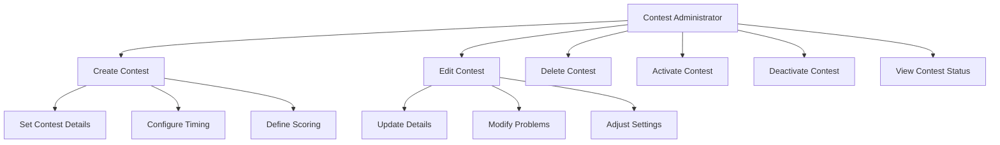
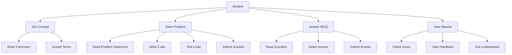

# Use Case Document - Skillnox Contest Platform

## 1. Document Information

| Field | Value |
|-------|-------|
| **Document Title** | Use Case Document - Skillnox Contest Platform |
| **Version** | 1.0 |
| **Date** | December 2024 |
| **Author** | Development Team |
| **Status** | Approved |

## 2. Executive Summary

This document outlines the use cases, user roles, and functional requirements for the Skillnox online coding contest platform. The system facilitates programming competitions with real-time monitoring, automated evaluation, and comprehensive management capabilities.

## 3. System Overview

### 3.1 Purpose
Skillnox is designed to provide a comprehensive platform for conducting online coding contests, enabling educational institutions to assess programming skills through competitive programming challenges.

### 3.2 Scope
The system covers the complete contest lifecycle from creation to completion, including participant management, real-time monitoring, automated evaluation, and result analysis.

## 4. User Roles and Responsibilities

### 4.1 System Administrator
- **Primary Role**: System maintenance and user management
- **Responsibilities**:
  - Manage user accounts and permissions
  - Monitor system performance and health
  - Configure system-wide settings
  - Handle technical support requests

### 4.2 Contest Administrator (Instructor)
- **Primary Role**: Contest creation and management
- **Responsibilities**:
  - Create and configure contests
  - Add programming problems and test cases
  - Import student data
  - Monitor contest progress
  - Generate reports and analytics
  - Manage contest participants

### 4.3 Student (Contestant)
- **Primary Role**: Contest participation
- **Responsibilities**:
  - Register for contests
  - Solve programming problems
  - Submit code solutions
  - Answer MCQ questions
  - View results and leaderboard

### 4.4 Guest User
- **Primary Role**: Limited system access
- **Responsibilities**:
  - View public contest information
  - Access system documentation
  - Register for new accounts

## 5. System Features

### 5.1 Core Features

#### Contest Management
- Create and configure coding contests
- Set contest duration and timing
- Define problem sets and scoring
- Manage participant registration
- Real-time contest monitoring

#### Problem Management
- Create programming problems
- Define test cases (visible and hidden)
- Set difficulty levels and point values
- Configure time and memory limits
- Support multiple programming languages

#### Code Execution Engine
- Sandboxed code execution
- Multi-language support (JavaScript, Python, Java, C++, C#, C)
- Automated test case evaluation
- Performance metrics collection
- Error handling and reporting

#### Anti-Cheat System
- Tab switch detection and monitoring
- Fullscreen enforcement
- Real-time violation tracking
- Automatic disqualification
- Security audit logging

#### Real-time Features
- Live leaderboard updates
- Real-time submission notifications
- WebSocket-based communication
- Live contest status updates

#### Analytics and Reporting
- Contest performance analytics
- Participant statistics
- Submission success rates
- Detailed score reports
- Export capabilities (PDF, Excel)

### 5.2 Advanced Features

#### MCQ Integration
- Multiple choice questions
- Single and multiple answer support
- Automated scoring
- Question randomization

#### User Management
- Role-based access control
- Student data import/export
- Profile management
- Authentication and authorization

#### System Administration
- Database management
- System configuration
- Performance monitoring
- Backup and recovery

## 6. Use Case Diagrams

### 6.1 High-Level Use Case Diagram

```mermaid
graph TB
    Admin[Contest Administrator]
    Student[Student]
    System[Skillnox System]
    Guest[Guest User]
    
    Admin --> UC1[Create Contest]
    Admin --> UC2[Manage Problems]
    Admin --> UC3[Import Students]
    Admin --> UC4[Monitor Contest]
    Admin --> UC5[Generate Reports]
    
    Student --> UC6[Join Contest]
    Student --> UC7[Solve Problems]
    Student --> UC8[Submit Code]
    Student --> UC9[View Leaderboard]
    Student --> UC10[Answer MCQs]
    
    Guest --> UC11[View Public Info]
    Guest --> UC12[Register Account]
    
    System --> UC13[Execute Code]
    System --> UC14[Anti-Cheat Monitoring]
    System --> UC15[Real-time Updates]
    System --> UC16[Score Calculation]
```

### 6.2 Detailed Use Case Diagrams

#### Contest Management Use Cases

#### Student Participation Use Cases

## 7. Detailed Use Cases

### 7.1 UC-001: Create Contest

**Actor**: Contest Administrator  
**Precondition**: Administrator is logged in  
**Main Flow**:
1. Administrator navigates to contest creation page
2. System displays contest creation form
3. Administrator enters contest details (title, description, duration)
4. Administrator sets start and end times
5. Administrator configures contest settings
6. System validates input data
7. System creates contest record
8. System confirms contest creation
9. Administrator is redirected to contest management page

**Alternative Flows**:
- 6a. Invalid data entered
  - 6a.1. System displays validation errors
  - 6a.2. Administrator corrects errors
  - 6a.3. Return to step 3

**Postcondition**: New contest is created and available for configuration

### 7.2 UC-002: Join Contest

**Actor**: Student  
**Precondition**: Student is logged in and contest is active  
**Main Flow**:
1. Student views available contests
2. Student selects a contest to join
3. System checks contest availability
4. System prompts for fullscreen mode
5. Student enters fullscreen mode
6. System starts anti-cheat monitoring
7. System displays contest interface
8. Student begins contest participation

**Alternative Flows**:
- 3a. Contest not available
  - 3a.1. System displays error message
  - 3a.2. Student returns to contest list
- 5a. Fullscreen denied
  - 5a.1. System blocks contest access
  - 5a.2. System displays fullscreen requirement message

**Postcondition**: Student is participating in the contest

### 7.3 UC-003: Submit Code Solution

**Actor**: Student  
**Precondition**: Student is in active contest with unsolved problem  
**Main Flow**:
1. Student selects a programming problem
2. System displays problem statement and test cases
3. Student writes code solution
4. Student tests code against sample test cases
5. Student submits final solution
6. System validates submission
7. System executes code against all test cases
8. System calculates score based on results
9. System updates leaderboard
10. System displays submission results

**Alternative Flows**:
- 6a. Invalid submission
  - 6a.1. System displays validation error
  - 6a.2. Student corrects and resubmits
- 7a. Code execution error
  - 7a.1. System logs error details
  - 7a.2. System assigns appropriate score
  - 7a.3. System displays error message

**Postcondition**: Code solution is submitted and scored

### 7.4 UC-004: Monitor Contest

**Actor**: Contest Administrator  
**Precondition**: Contest is active with participants  
**Main Flow**:
1. Administrator navigates to contest monitoring page
2. System displays real-time contest dashboard
3. Administrator views participant list
4. Administrator monitors submission activity
5. Administrator checks leaderboard updates
6. Administrator reviews anti-cheat violations
7. System provides real-time updates

**Alternative Flows**:
- 4a. No activity detected
  - 4a.1. System displays "No recent activity" message
- 6a. Violation detected
  - 6a.1. System highlights violation
  - 6a.2. Administrator can take action

**Postcondition**: Administrator has real-time contest visibility

### 7.5 UC-005: Anti-Cheat Monitoring

**Actor**: System  
**Precondition**: Student is in active contest  
**Main Flow**:
1. System monitors tab visibility changes
2. System tracks window focus events
3. System monitors fullscreen state
4. System detects potential violations
5. System logs violation details
6. System increments violation counter
7. System checks violation threshold
8. System takes appropriate action

**Alternative Flows**:
- 7a. Threshold exceeded
  - 7a.1. System disqualifies participant
  - 7a.2. System notifies administrator
  - 7a.3. System blocks further participation

**Postcondition**: Contest integrity is maintained

### 7.6 UC-006: Generate Reports

**Actor**: Contest Administrator  
**Precondition**: Contest has been completed  
**Main Flow**:
1. Administrator navigates to reports section
2. Administrator selects contest for reporting
3. System retrieves contest data
4. System calculates statistics and metrics
5. System generates report data
6. Administrator selects report format
7. System exports report file
8. Administrator downloads report

**Alternative Flows**:
- 4a. No data available
  - 4a.1. System displays "No data" message
- 7a. Export fails
  - 7a.1. System displays error message
  - 7a.2. Administrator retries export

**Postcondition**: Report is generated and available for download

## 8. Non-Functional Requirements

### 8.1 Performance Requirements
- **Response Time**: API responses within 200ms
- **Throughput**: Support 1000+ concurrent users
- **Code Execution**: Test case evaluation within 5 seconds
- **Real-time Updates**: WebSocket latency under 100ms

### 8.2 Security Requirements
- **Authentication**: Secure session management
- **Authorization**: Role-based access control
- **Data Protection**: Encrypted data transmission
- **Anti-Cheat**: Real-time violation detection

### 8.3 Usability Requirements
- **Interface**: Intuitive user interface
- **Accessibility**: WCAG 2.1 compliance
- **Responsiveness**: Mobile-friendly design
- **Documentation**: Comprehensive user guides

### 8.4 Reliability Requirements
- **Uptime**: 99.9% system availability
- **Data Integrity**: ACID compliance
- **Backup**: Daily automated backups
- **Recovery**: 4-hour RTO, 1-hour RPO

## 9. System Constraints

### 9.1 Technical Constraints
- **Browser Support**: Modern browsers (Chrome, Firefox, Safari, Edge)
- **Database**: PostgreSQL 12+
- **Runtime**: Node.js 18+
- **Memory**: Minimum 2GB RAM per instance

### 9.2 Business Constraints
- **User Capacity**: Maximum 10,000 registered users
- **Contest Size**: Maximum 500 participants per contest
- **Storage**: 100GB maximum data storage
- **Concurrent Contests**: Maximum 50 active contests

## 10. Assumptions and Dependencies

### 10.1 Assumptions
- Users have stable internet connectivity
- Participants use modern web browsers
- Contest administrators are technically competent
- Students understand basic programming concepts

### 10.2 Dependencies
- PostgreSQL database availability
- Redis cache service
- WebSocket support in browsers
- File system access for code execution

## 11. Success Criteria

### 11.1 Functional Success
- All use cases execute without errors
- System handles expected user load
- Anti-cheat mechanisms function effectively
- Real-time features work reliably

### 11.2 Non-Functional Success
- System meets performance requirements
- Security measures prevent unauthorized access
- User interface is intuitive and responsive
- System maintains high availability

## 12. Risk Assessment

### 12.1 Technical Risks
- **Code Execution Security**: Sandboxing failures
- **Performance Degradation**: High load scenarios
- **Data Loss**: Database corruption or failure
- **Browser Compatibility**: Cross-browser issues

### 12.2 Mitigation Strategies
- Comprehensive testing and validation
- Load testing and performance optimization
- Regular backups and disaster recovery
- Cross-browser compatibility testing

---

**Document Version**: 1.0  
**Last Updated**: December 2024  
**Author**: Development Team  
**Review Status**: Approved
